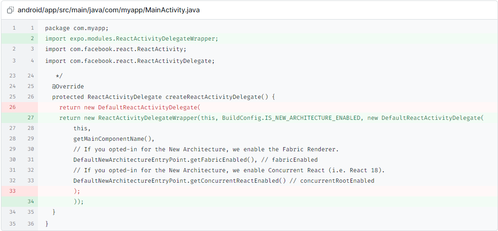
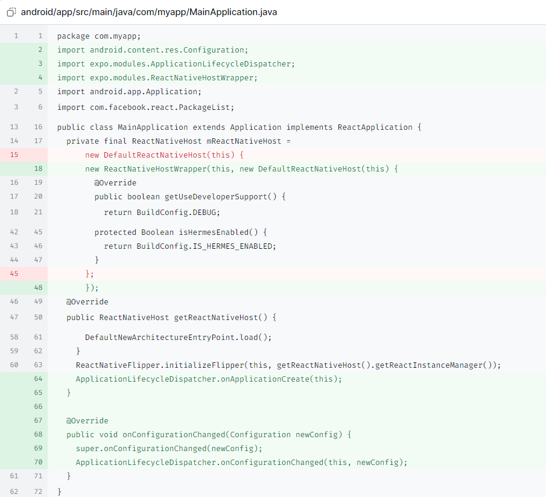
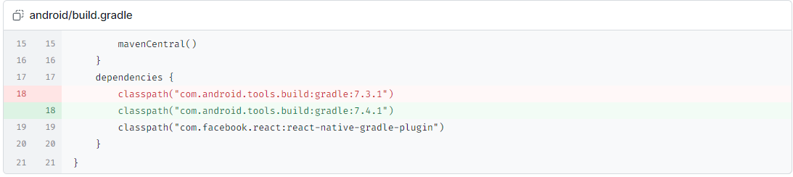
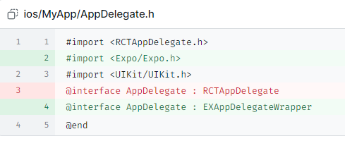
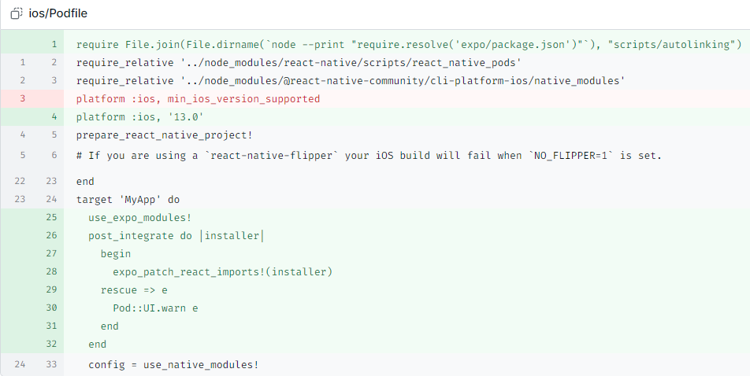

# React Native 打包 APK 过程

在 React Native 中，打包 APK（Android Package Kit）是将应用程序准备好以在 Android 设备上运行的过程。以下是创建和发布 React Native 应用的 APK 的步骤：


## !!!一定记得改@别名


## 步骤 1: 初始化项目

首先，确保已经安装了 Node.js、Android Studio 和 JDK（Java Development Kit）。然后，可以使用以下命令创建一个新的 React Native 项目：

```bash
npx react-native@latest init AwesomeProject
```


## 步骤 2: 安装 React Native Expo 模块

如果您希望在原生 React Native 项目中使用 Expo 模块，可以按照以下步骤进行配置。


！！！建议使用自动安装


### 自动安装：

运行以下命令以自动安装 Expo 模块：

```bash
npx install-expo-modules@latest
```


### 手动安装：

#### 安卓：

需在react-native项目需要安装：

```
npm install expo
```


##### android/app/src/main/java/com/myapp/MainActivity.java

```java
package com.myapp;

// ✨新增
import expo.modules.ReactActivityDelegateWrapper;

import com.facebook.react.ReactActivity;
import com.facebook.react.ReactActivityDelegate;
   */
  @Override
  protected ReactActivityDelegate createReactActivityDelegate() {
    // ❌删除
    // return new DefaultReactActivityDelegate(

    // ✨新增
    return new ReactActivityDelegateWrapper(this, BuildConfig.IS_NEW_ARCHITECTURE_ENABLED, new DefaultReactActivityDelegate(
        this,
        getMainComponentName(),
        // If you opted-in for the New Architecture, we enable the Fabric Renderer.
        DefaultNewArchitectureEntryPoint.getFabricEnabled(), // fabricEnabled
        // If you opted-in for the New Architecture, we enable Concurrent React (i.e. React 18).
        DefaultNewArchitectureEntryPoint.getConcurrentReactEnabled() // concurrentRootEnabled
      );
    ));
  }
}
```




##### android/app/src/main/java/com/myapp/MainApplication.java

```java
package com.myapp;
import android.content.res.Configuration;

// ✨新增
import expo.modules.ApplicationLifecycleDispatcher;
// ✨新增
import expo.modules.ReactNativeHostWrapper;

import android.app.Application;
import com.facebook.react.PackageList;
public class MainApplication extends Application implements ReactApplication {
private final ReactNativeHost mReactNativeHost =

// new DefaultReactNativeHost(this) {
// ✨新增
new ReactNativeHostWrapper(this, new DefaultReactNativeHost(this) {
	@Override
	public boolean getUseDeveloperSupport() {
		return BuildConfig.DEBUG;
		protected Boolean isHermesEnabled() {
			return BuildConfig.IS_HERMES_ENABLED;
		}
		❌删除
	// };
	// ✨新增
	});


	@Override
	public ReactNativeHost getReactNativeHost() {
		DefaultNewArchitectureEntryPoint.load();
	}
	ReactNativeFlipper.initializeFlipper(this, getReactNativeHost().getReactInstanceManager());
	// ✨新增
	ApplicationLifecycleDispatcher.onApplicationCreate(this);
// ✨新增
}

// ✨新增
@Override
// ✨新增
public void onConfigurationChanged(Configuration newConfig) {
	// ✨新增
	super.onConfigurationChanged(newConfig);
	// ✨新增
	ApplicationLifecycleDispatcher.onConfigurationChanged(this, newConfig);
}
}
```




##### android/build.gradle

```java
mavenCentral()
    }
    dependencies {
			// ❌删除
      classpath("com.android.tools.build:gradle:7.3.1")
			// ✨新增
    	classpath("com.android.tools.build:gradle:7.4.1")
    	classpath("com.facebook.react:react-native-gradle-plugin")
    }
}
```




##### android/settings.gradle

```java
apply from: file("../node_modules/@react-native-community/cli-platform-android/native_modules.gradle"); applyNativeModulesSettingsGradle(settings)
include ':app'
includeBuild('../node_modules/react-native-gradle-plugin')

// ✨新增
apply from: new File(["node", "--print", "require.resolve('expo/package.json')"].execute(null, rootDir).text.trim(), "../scripts/autolinking.gradle")
// ✨新增
useExpoModules()
```


#### 苹果:

##### ios/MyApp/AppDelegate.h

```
#import <RCTAppDelegate.h>
// ✨新增
#import <Expo/Expo.h>
#import <UIKit/UIKit.h>
// ❌删除
@interface AppDelegate : RCTAppDelegate
// ✨新增
@interface AppDelegate : EXAppDelegateWrapper
@end
```




##### ios/Podfile

```java
// ✨新增
require File.join(File.dirname(`node --print "require.resolve('expo/package.json')"`), "scripts/autolinking")
require_relative '../node_modules/react-native/scripts/react_native_pods'
require_relative '../node_modules/@react-native-community/cli-platform-ios/native_modules'
// ❌删除
platform :ios, min_ios_version_supported
// ✨新增
platform :ios, '13.0'
prepare_react_native_project!
# If you are using a `react-native-flipper` your iOS build will fail when `NO_FLIPPER=1` is set.
end
target 'MyApp' do
// ✨新增
use_expo_modules!
// ✨新增
post_integrate do |installer|
// ✨新增
begin
// ✨新增
expo_patch_react_imports!(installer)
// ✨新增
rescue => e
// ✨新增
Pod::UI.warn e
// ✨新增
end
// ✨新增
end


config = use_native_modules!
```




## 步骤 3: 生成 Debug APK

### 步骤 3.1: 打包 JavaScript 代码

在终端中，进入项目根目录并运行以下命令，将 JavaScript 代码打包到 Android 项目中：

```bash
npx react-native bundle --platform android --dev false --entry-file index.js --bundle-output android/app/src/main/assets/index.android.bundle --assets-dest android/app/src/main/res
```

### 步骤 3.2: 生成 Debug APK

进入 `android` 目录：

```bash
cd android
```

在 Android 目录中运行以下命令以生成 Debug APK：

```bash
./gradlew assembleDebug
```

生成的 Debug APK 文件位于以下路径：

```
yourProject/android/app/build/outputs/apk/debug/app-debug.apk
```

这个 APK 可以用于在设备上进行测试和调试。


## 步骤 4: 生成 Release APK

### 步骤 4.1: 生成签名密钥库

首先，您需要创建一个 Java 生成的签名密钥库，用于为 React Native 生成可发布的 APK 文件。运行以下命令来创建密钥库：

```bash
keytool -genkey -v -keystore your_key_name.keystore -alias your_key_alias -keyalg RSA -keysize 2048 -validity 10000
```

确保替换 `your_key_name` 和 `your_key_alias` 为您自己的名称和别名。在此过程中，您需要设置密码，确保记住它们。

### 步骤 4.2: 将密钥库添加到项目中

将刚刚创建的密钥库文件 `your_key_name.keystore` 复制到 React Native 项目的 `android/app` 目录下。

在 `android/app/build.gradle` 文件中配置签名密钥库，可以选择安全或不安全的方式：

#### 安全方式：

```gradle
android {
    // ...
    signingConfigs {
        release {
            storeFile file('your_key_name.keystore')
            storePassword System.console().readLine("\nKeystore password:")
            keyAlias System.console().readLine("\nAlias: ")
            keyPassword System.console().readLine("\nAlias password: ")
        }
    }
    buildTypes {
        release {
            // ...
            signingConfig signingConfigs.release
        }
    }
}
```

这种方式会在构建时提示输入密码，更加安全。

#### 不安全方式：

```gradle
android {
    // ...
    signingConfigs {
        release {
            storeFile file('your_key_name.keystore')
            storePassword 'your_key_store_password'
            keyAlias 'your_key_alias'
            keyPassword 'your_key_file_alias_password'
        }
    }
    buildTypes {
        release {
            // ...
            signingConfig signingConfigs.release
        }
    }
}
```

这种方式将密码存储在 Gradle 文件中，不建议在生产环境中使用。

### 步骤 4.3: 生成 Release APK

在 `android` 目录中运行以下命令以生成 Release APK：

对于 Windows：

```bash
gradlew assembleRelease
```

