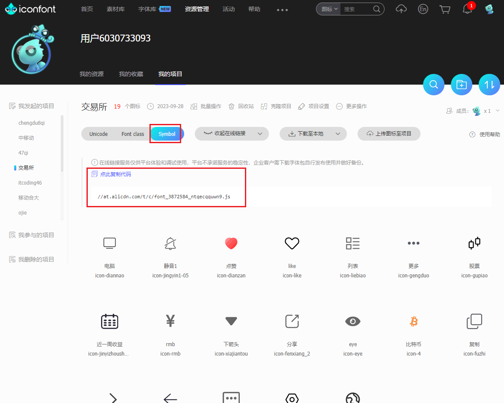

# ReactNative Icon图标生成

## 第一步：安装react-native-svg和react-native-iconfont-cli

特别注意：`react-native-svg`的版本只能13.9.0

```
yarn add react-native-svg@13.9.0
yarn add react-native-iconfont-cli --dev
```


## 第二步：生成iconfont.json配置文件

执行完该命令后，会在项目根目录生成iconfont.json

```
npx iconfont-init
```

内容如下：

```
{
    "symbol_url": "请参考README.md，复制官网提供的JS链接",
    "use_typescript": false,
    "save_dir": "./src/iconfont",
    "trim_icon_prefix": "icon",
    "default_icon_size": 18,
    "local_svgs": "./localSvgs"
}
```


## 第三步：修改iconfont.json的配置

到iconfont官网收集好图标后，复制连接。将iconfont.json文件内容修改为：

```
{
  "symbol_url": "//at.alicdn.com/t/c/font_3872584_ntqecqquwn9.js",
  "use_typescript": true,
  "save_dir": "./src/components/LJNIcon/iconfont",
  "trim_icon_prefix": "icon",
  "default_icon_size": 18,
  "local_svgs": ""
}
```




## 第四步：生成图标组件

执行下方命令，图标就会以react组件的方式生成在`./src/components/LJNIcon/iconfont`位置

```
npx iconfont-rn
```


## 第五步：使用

导入组件后，像普通组件一样使用即可

```
<IconFont name="alipay" size={20} />
```

